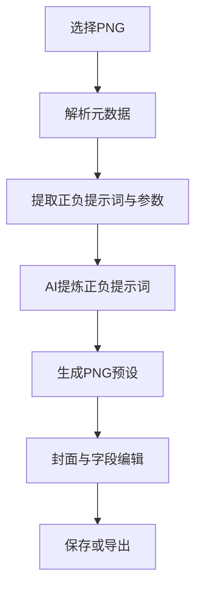

# PNG 导入画师串方案（设计稿）

## 目标
- 在图片管理中支持导入 PNG，并从 NovelAI / SD 元数据解析提示词。
- 解析后的提示词交给 AI 提炼，输出正负提示词（风格/画师串等），过滤构图与角色信息。
- 生成“PNG 详细预设”（新类型），可选将导入图片作为预设封面（DataUrl）。
- 支持导出 / 导入 JSON，携带封面与详细预设数据。
- 生图时根据模型类型拼接不同内容：非 Nai / SD 类模型只用提示词，忽略后处理参数。

## 关键结论（已确认）
- 提炼使用新增独立配置（API / Key / 模型）。
- 新增“PNG 预设”类型，不扩展画师串预设。
- 封面存 DataUrl，导出可携带。
- 详细预设保留：采样器、步数、CFG、clip skip、Hires、ADetailer 等后处理、Model / Lora 名、Negative prompt；忽略分辨率与种子。
- 详细参数需要分组展示；保留原始元数据并随导出携带。

## 现状观察
- 图片管理与预设管理位于 [`components/features/Social/ImageManagerModal.tsx`](components/features/Social/ImageManagerModal.tsx) 与 [`components/features/Social/mobile/MobileImageManagerModal.tsx`](components/features/Social/mobile/MobileImageManagerModal.tsx)。
- 图片生成与词组转化流程位于 [`services/ai/imageTasks.ts`](services/ai/imageTasks.ts)。
- 生图工作流位于 [`hooks/useGame/npcImageWorkflow.ts`](hooks/useGame/npcImageWorkflow.ts) 与 [`hooks/useGame/sceneImageWorkflow.ts`](hooks/useGame/sceneImageWorkflow.ts)。
- 类型集中在 [`types.ts`](types.ts) 与模型定义如 [`models/imageGeneration.ts`](models/imageGeneration.ts)。

## 方案概览
1. PNG 解析：前端读取 PNG 二进制并解析 tEXt / iTXt 元数据。
2. 元数据规范化：优先解析 NovelAI 或 SD 参数串，提取正向与负向提示词、模型信息与后处理字段。
3. AI 提炼：将解析出的提示词交给 AI 提炼，输出“正负提示词”，过滤构图与角色。
4. 生成 PNG 详细预设：
   - 正面提示词 = AI 提炼结果
   - 负面提示词 = AI 提炼结果（可参考原始 Negative）
   - 详细参数 = 采样器 / 步数 / CFG / clip skip / Hires / ADetailer / Model / Lora 等
   - 封面 = 导入 PNG 转 DataUrl
5. 导出 / 导入 JSON：包含预设主体 + 封面 + 版本信息 + 原始元数据。

## 数据结构调整
- 新增 PNG 预设类型：
  - `id` / `名称` / `正面提示词` / `负面提示词`
  - `封面DataUrl`
  - `详细参数`：采样器、步数、CFG、clip skip、Hires、ADetailer、Model、Lora 等
  - `来源元数据`（保存并随导出携带）
  - `createdAt` / `updatedAt`

## AI 提炼策略
- 输入：解析出的正负提示词 + 可选 PNG 图像。
- 输出：
  - `正面提示词`：风格 / 画师串 / 质量串等
  - `负面提示词`
- 过滤原则：
  - 去除构图标签（portrait、full body、upper body、close-up 等）
  - 去除角色标签（1girl、1boy、solo、角色名、具体外貌）

## UI 与交互设计
- 在图片管理预设区域新增“导入 PNG 预设”入口。
- 导入后展示“预设草稿”，可编辑名称、提示词与封面。
- 详细预设以“美化展示”方式呈现（非原始字符串）。
  - 分组展示：采样设置 / 模型与 LoRA / 后处理
- 生图时：
  - 若模型为 Nai / SD，可将详细参数映射为对应字段。
  - 若模型为 grok 或 gemini，忽略详细参数，仅使用提示词。

## 导出 / 导入 JSON
- JSON 结构包含版本字段：
  - `version: 1`
  - `presets: [PNG预设结构]`
- `封面DataUrl` 直接嵌入。
- `来源元数据` 随导出携带。

## 流程示意

## 风险与回退
- 元数据缺失或不完整：直接用 AI 读图提炼。
- AI 不可用：保留原始提示词作为正负提示词。
- 非 Nai / SD 模型：详细参数忽略，仅提示词生图。

## 实施清单（执行步骤）
1. 类型与数据结构
   - 新增 PNG 预设结构与存储位置，补充封面与详细参数字段。
   - JSON 导入导出结构增加版本与来源元数据。
2. 元数据解析
   - 解析 PNG tEXt / iTXt；识别 NovelAI / SD 参数串。
   - 提取 prompt、negative prompt、Model、LoRA、采样器、步数、CFG、clip skip、Hires、ADetailer。
3. AI 提炼服务
   - 新增“PNG 提炼接口配置”（API / Key / 模型）。
   - 新增提示词模板：强调风格与画师串，禁止构图 / 角色。
4. UI 入口与流程
   - 图片管理中新增“导入 PNG 预设”按钮。
   - 草稿弹层支持编辑名称、正负提示词、封面选择。
   - 详细参数美化分组展示。
5. 生图拼接策略
   - Nai / SD：提示词 + 详细参数映射。
   - grok / gemini：仅提示词。
6. 导出 / 导入
   - 预设 JSON 支持导入与导出，携带封面与来源元数据。

## 待确认
- 详细参数字段在 UI 中的具体中文命名样式。
